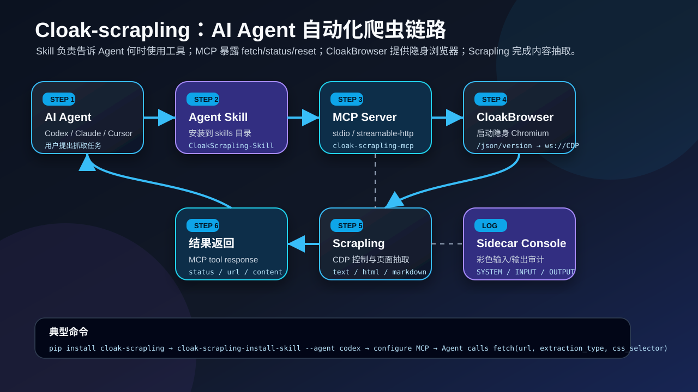

# Cloak-scrapling

[English](README.en.md) | 简体中文

面向 AI Agent 的浏览器爬虫桥接工具包。`cloak-scrapling` 将 CloakBrowser 的隐身 Chromium 能力与 Scrapling 的页面抽取能力封装为 CLI、MCP Server 和 Agent Skill，让支持 MCP 的 Agent 可以通过真实浏览器抓取动态网页。



## 功能概览

- **MCP Server**：提供网页抓取、页面打开、元素状态、点击、输入、截图和浏览器生命周期工具。
- **CLI 抓取**：通过 `cloak-scrapling-fetch` 执行一次性抓取。
- **交互式 Shell**：通过 `cloak-scrapling-shell` 使用中英文抽取命令与页面交互命令。
- **核心 Session API**：通过 `CloakScraplingSession` 统一调用抓取、MCP 抽取和页面交互能力。
- **Agent Skill**：通过 `cloak-scrapling-install-skill` 安装到 Codex / Claude。
- **内置 CloakBrowser + Scrapling 源码**：随包发布两者 Python 源码，自动启动浏览器、解析 CDP WebSocket，并返回 `text` / `html` / `markdown`。
- **BrowserAct-like 浏览器核心管理**：通过 `cloak-scrapling-browser` 查看、安装、清理当前平台浏览器核心。
- **Sidecar Console**：可选显示彩色输入输出日志。

## 快速开始

```powershell
python -m pip install cloak-scrapling
cloak-scrapling-fetch https://example.com --selector "title::text"
```

`cloakbrowser` 与 `scrapling` 的 Python 源码已内置到本包中；浏览器核心按 `CLOAKBROWSER_BINARY_PATH`、`vendor_browser/<platform>/`、CloakBrowser 缓存、下载安装的顺序解析。

本地 wheel 安装：

```powershell
python -m pip install --force-reinstall .\dist\cloak_scrapling-0.1.1-py3-none-any.whl
```

## 文档

| 文档 | 内容 |
| --- | --- |
| [安装与打包](docs/zh-CN/installation/README.md) | pip 安装、本地 wheel、源码安装、重新打包。 |
| [使用说明](docs/zh-CN/usage/README.md) | CLI、交互式 Shell、Python API、环境变量。 |
| [MCP 工具](docs/zh-CN/mcp/README.md) | MCP Server、工具列表、`fetch` 参数。 |
| [AI Agent 接入](docs/zh-CN/agents/README.md) | Codex、Claude、Cursor、Windsurf、Cline/Roo Code 配置。 |
| [开发与安全](docs/zh-CN/development/README.md) | 测试、打包检查、安全注意事项。 |
| [架构说明](docs/architecture.md) | 桥接链路与实现结构。 |
| [第三方源码](THIRD_PARTY_SOURCES.md) | 内置 Scrapling / CloakBrowser 来源、提交与许可证。 |

## 命令

```powershell
cloak-scrapling-fetch --help
cloak-scrapling-shell --help
cloak-scrapling-mcp --help
cloak-scrapling-browser --help
cloak-scrapling-install-skill --help
cloakbrowser --help
scrapling --help
```

交互式页面操作：

```powershell
cloak-scrapling-shell --lang zh
```

```text
open https://example.com
state
input 2 hello
click 3
text body
```

## 基本 MCP 配置

```toml
[mcp_servers.cloak-scrapling]
type = "stdio"
command = "cloak-scrapling-mcp"
args = []
```

如果 Agent 找不到命令，可以使用模块方式：

```toml
[mcp_servers.cloak-scrapling]
type = "stdio"
command = "python"
args = ["-m", "cloak_scrapling.mcp_server"]
```

## Python API

新代码优先使用 `CloakScraplingSession`。CLI、MCP 与后续类 Codex / Claude Code 的 TUI 都会复用这层核心门面：

```python
import asyncio
from cloak_scrapling import CloakScraplingSession

async def main() -> None:
    async with CloakScraplingSession() as session:
        await session.open("https://example.com")
        state = await session.state()
        print(state.to_text())
        page = await session.fetch("https://example.com", wait=100)
        print(page.css("title::text").get())

asyncio.run(main())
```

`CloakScraplingBridge` 仍保留，用于兼容既有脚本。

## 状态

当前项目包含 `cloak_scrapling`、`cloakbrowser` 与 `scrapling` 三组 Python 包，已完成 wheel / sdist 打包，并通过：

```powershell
python -m twine check dist\*
```

## 许可证

本项目主体为 MIT License。见 [LICENSE](LICENSE)。

内置上游源码保留原许可证声明：

- Scrapling：BSD-3-Clause，见 [SCRAPLING-BSD-3-CLAUSE.txt](third_party_licenses/SCRAPLING-BSD-3-CLAUSE.txt)。
- CloakBrowser：MIT，见 [CLOAKBROWSER-MIT.txt](third_party_licenses/CLOAKBROWSER-MIT.txt)。
